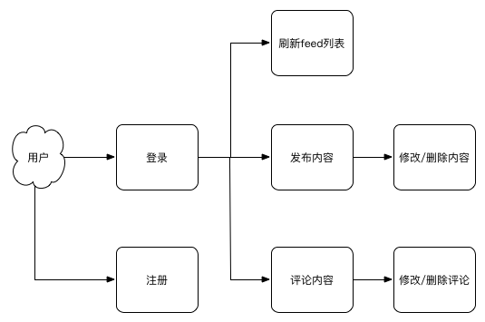

# 系统业务流程文档

| 作者 | 版本 |  日期 | 改动
|----|:----:|:-----|-----
| xx | V1.0 | 2016-02-25 | 初始版本

[本文档主要对系统的业务流程进行描述，包括系统的参与角色、每个角色的业务流程等。]

## 系统角色

### 1. 管理员

对于此角色的描述

### 2. 用户

对于此角色的描述

## 总体流程

[这里的流程图主要是为了描述清楚系统各个参与者的流程、用例。通过此图能够理清需要哪些接口、模块功能等]

一个例子：

## 用户流程

[这里的流程图主要是为了描述某一个参与者的流程、用例。是对总体流程的补充]

## 管理员流程

[这里的流程图主要是为了描述某一个参与者的流程、用例。是对总体流程的补充]
 