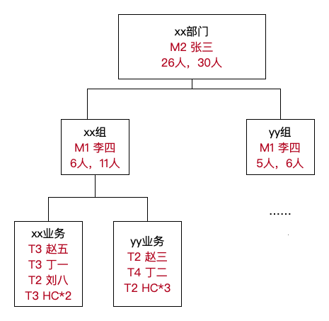

### 一. 组织架构图

要素：

- 规模：当前人数，预算新增人数，总人数
- 分工：业务方向划分，业务负责人
- 梯队：人员级别分布，人员梯队结构

### 二. 资源盘点

- T1级别：3人，当前2人，预算新增1人
- T2级别：n人，当前x人，预算新增y人 
- T3级别：...

### 三. 重点培养对象

- 张三，xx业务核心研发工程师，到年底能完全负责 XX 业务，并能带新人
- 李四，yy业务Leader，到年底能独立负责yy业务带n人。
