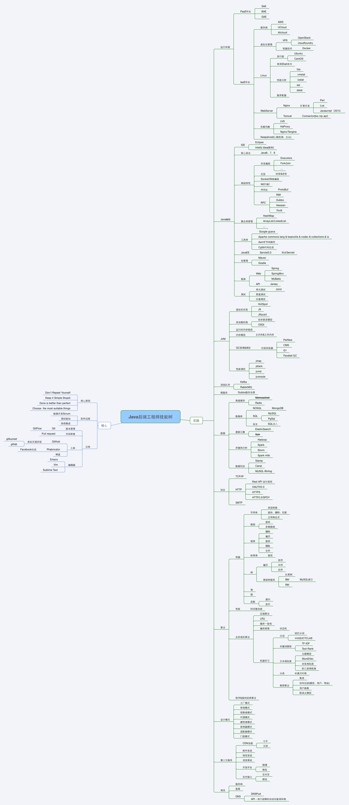

# Java后端技术体系

在互联网火热的今天，整个技术体系主要分为前端技术和后端技术，也可以叫做客户端技术和服务端技术。这里所说的java工程师，则主要是指的后端开发。相比起前端技术的各种各样以及不可预测性（比如诺基亚的symbian在火爆了n年以后瞬间毁灭），后端的技术还是比较稳定的，至少不会突然就走下历史舞台。但是后端技术的涵盖范围实在太广，Web、大数据、高并发、数据挖掘、数据库....这些也不是一个人能够全部掌握的。这里所说的后端技术体系，仅仅指的是一些Java后端工程师应该必备的技能。

对于一个Java后端工程师来说，抛开语言不谈，具有的技术体系应该包括但不限于以下几点：

- DevOps
- 消息队列
- 认证技术-oAuth
- 关系型数据库
- 非关系型数据库
- Java开发框架
- 分布式&大数据

更为全面的，可以参考下面的Java后端工程师技能树(内容借鉴自https://github.com/geekcompany/full-stack-tree)。

